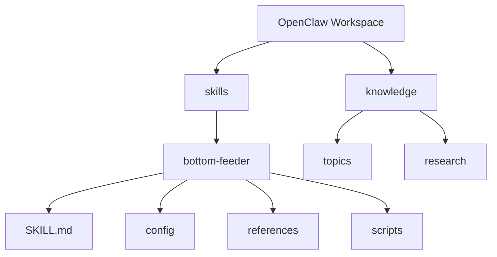

# 🦞 Bottom Feeder

**A depth-first knowledge crawler skill for OpenClaw** that researches high-value topics without nuking your balance.  
Small sips by default. Big feast mode only when you say so. 🌊

---

## ✨ What it does

Bottom Feeder runs a 4-stage pipeline:

1. 🎯 **Topic Selection** (pick the best 1–2 topics)
2. 🔎 **Research Collection** (Brave baseline + optional modules)
3. 🧠 **Synthesis** (durable, useful markdown)
4. 📝 **Output Writing** (to `knowledge/topics/` or `knowledge/research/`)

It is designed for **depth over spam** and **budget-aware behavior**.

---

## 📦 Folder placement (noob-safe)

Put this repo folder inside your OpenClaw workspace `skills/` directory.

```text
/root/.openclaw/workspace/
├── skills/
│   ├── bottom-feeder/   👈 place this folder here
│   │   ├── SKILL.md
│   │   ├── config/
│   │   ├── references/
│   │   └── scripts/
│   └── (other skills...)
└── knowledge/
    ├── topics/
    └── research/
```

### Mermaid map 🗺️



---

## 🚀 Quick start

1. Copy this folder into `workspace/skills/bottom-feeder`
2. Confirm files exist:
   - `SKILL.md`
   - `config/defaults.yaml`
   - `scripts/provider-usage.sh`
   - `scripts/check-balance.sh`
3. Run a low-burn test:
   - one topic
   - Brave-only source
   - output to `knowledge/topics/<slug>.md`

---

## 💸 Balance behavior

- **Routine mode**: low-cost and cautious
- **Burn mode**: only when explicitly requested
- **Reserve guardrail**: keeps `min_reserve_diem` by default

Bottom Feeder can read usage from the optional Tide Pool plugin (`provider-usage.sh`) and parse balances via `check-balance.sh`.

---

## 🧪 Included scripts

- `scripts/provider-usage.sh` — provider usage snapshot (with Tide Pool / legacy fallback)
- `scripts/check-balance.sh` — parse budget from JSON (`remaining|balance|credits|venice.data.diem`)
- `scripts/estimate-cost.sh` — rough cost estimate by mode/source count

---

## 🦞 Vibe notes

- Keep it crusty
- Keep it clean
- Don’t zero the tank unless boss says so

**Ran rah. Click clack.**
