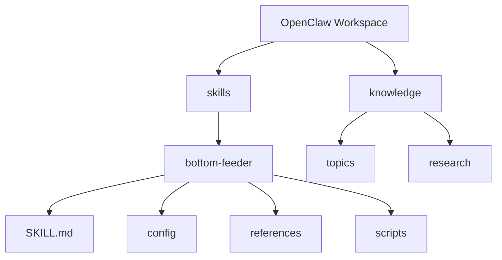

# 🦞 Bottom Feeder

**A depth-first knowledge crawler skill for OpenClaw** that researches high-value topics without nuking your balance.  
Small sips by default. Big feast mode only when you say so. 🌊

---

## ✨ What it does

Bottom Feeder runs a 4-stage pipeline:

1. 🎯 **Topic Selection** (pick the best 1–2 topics)
2. 🔎 **Research Collection** (Brave baseline + optional modules)
3. 🧠 **Synthesis** (durable, useful markdown)
4. 📝 **Output Writing** (to `knowledge/topics/` or `knowledge/research/`)

It is designed for **depth over spam** and **budget-aware behavior**.

**Works with any provider** — Anthropic, OpenAI, Venice/Diem, or whatever you're running. No vendor lock-in.

---

## 📦 Folder placement (noob-safe)

Put this repo folder inside your OpenClaw workspace `skills/` directory.

```text
/root/.openclaw/workspace/
├── skills/
│   ├── bottom-feeder/   👈 place this folder here
│   │   ├── SKILL.md
│   │   ├── config/
│   │   ├── references/
│   │   └── scripts/
│   └── (other skills...)
└── knowledge/
    ├── topics/
    └── research/
```

### Mermaid map 🗺️



---

## 🚀 Quick start

1. Copy this folder into `workspace/skills/bottom-feeder`
2. Confirm files exist:
   - `SKILL.md`
   - `config/defaults.yaml`
   - `scripts/provider-usage.sh`
   - `scripts/check-balance.sh`
3. Customize `config/topics.md` for your team's needs (see the file for guidance)
4. Run a low-burn test:
   - one topic
   - Brave-only source
   - output to `knowledge/topics/<slug>.md`

---

## 💸 Balance behavior

- **Routine mode**: low-cost and cautious (1 topic, default sources, concise synthesis)
- **Burn mode**: only when explicitly requested (all sources, deeper synthesis, heavier model)
- **Reserve guardrail**: configurable via `min_reserve_usd` (or legacy `min_reserve_diem`)
- **Multi-profile support**: if your provider has multiple auth profiles (team seats, API keys), the agent tracks rotation and flags when a profile is exhausted

Bottom Feeder can read usage from the optional Tide Pool plugin (`provider-usage.sh`) and parse balances via `check-balance.sh`.

---

## 🧪 Included scripts

- `scripts/provider-usage.sh` — provider usage snapshot (Tide Pool → legacy lobster → `openclaw status` fallback)
- `scripts/check-balance.sh` — parse budget from JSON (supports `remaining`, `balance`, `credits`, or `venice.data.diem`)
- `scripts/estimate-cost.sh` — rough relative cost estimate by mode/source count

---

## 🔧 Customization

### Topic seeds (`config/topics.md`)
Replace the default topics with what matters to your team. Organize by priority tiers — the agent will pick the highest-value topics first. The more specific your seeds, the better the output.

### Sources
Default: Brave search + local knowledge. Optional: Perplexity (deep synthesis), Twitter (sentiment), CoinGecko/CoinMarketCap (crypto data), browser (page extraction). Add your own source modules in `references/research-sources/`.

### Budget
Set `min_reserve_usd: 0` for no reserve, or a positive number to keep a safety buffer. For Venice-first setups, keep `min_reserve_diem` as a legacy fallback reserve when USD is not configured. Optional per-topic caps can use provider-agnostic `max_estimated_cost_units_per_topic_*` (legacy `max_estimated_diem_per_topic_*` remains supported).

---

## 🦞 Vibe notes

- Keep it crusty
- Keep it clean
- Don't zero the tank unless boss says so

**Ran rah. Click clack.**
